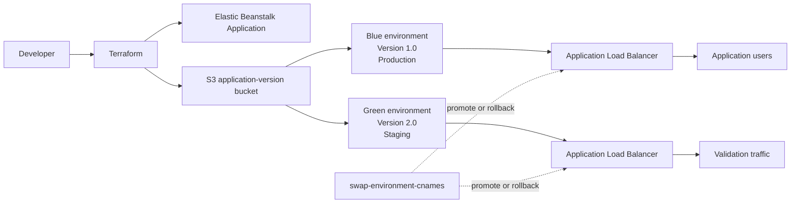

# Blue-Green Deployment Using Elastic Beanstalk

This example provisions two independent AWS Elastic Beanstalk environments for the same Node.js application:

- **Blue**: Version 1.0, initially serving production traffic.
- **Green**: Version 2.0, initially used for staging and pre-production validation.

The environments are created with Terraform. Once Green is healthy and verified, AWS Elastic Beanstalk swaps their CNAMEs so production traffic moves to Version 2.0 without rebuilding the environments. Running the same swap again provides a quick rollback.

## Architecture



### Resource flow

1. Terraform creates the Elastic Beanstalk application, IAM roles, instance profile, and private S3 bucket.
2. `app-v1.zip` is uploaded to S3 and deployed to the Blue environment.
3. `app-v2.zip` is uploaded to S3 and deployed to the Green environment.
4. Both environments use an Application Load Balancer, enhanced health reporting, and one to two `t3.micro` instances.
5. The AWS CLI swaps the environment CNAMEs. The environment names stay the same; the CNAME ownership changes.

## Project layout

| Path | Purpose |
|---|---|
| `main.tf` | AWS provider, IAM roles, instance profile, Beanstalk application, and version bucket |
| `blue-environment.tf` | Version 1.0 artifact and Blue production environment |
| `green-environment.tf` | Version 2.0 artifact and Green staging environment |
| `variables.tf` | Region, platform, instance type, application name, and tags |
| `outputs.tf` | Environment names, URLs, CNAMEs, and swap instructions |
| `package-apps.ps1` | Creates both application ZIP files on Windows |
| `package-apps.sh` | Creates both application ZIP files on Linux/macOS |
| `swap-environments.ps1` | Interactive CNAME swap helper for PowerShell |
| `swap-environments.sh` | CNAME swap helper for Bash |
| `app-v1/` | Node.js Version 1.0 application source |
| `app-v2/` | Node.js Version 2.0 application source |

## Prerequisites

- Terraform CLI 1.0 or newer.
- AWS CLI configured with credentials for the target account.
- An AWS IAM identity allowed to manage Elastic Beanstalk, EC2/Auto Scaling, Elastic Load Balancing, IAM roles and policies, S3, and CloudFormation resources used by Elastic Beanstalk.
- PowerShell on Windows, or Bash on Linux/macOS.
- An AWS region with the selected Elastic Beanstalk Node.js platform available.

The example defaults to `us-east-1` and `t3.micro`. Review `terraform.tfvars` before applying. The solution stack in `terraform.tfvars` must be available in the selected region; check with:

```bash
aws elasticbeanstalk list-available-solution-stacks --region us-east-1
```

## Deploy

Run every Terraform command from this directory.

### 1. Package both application versions

Windows PowerShell:

```powershell
.\package-apps.ps1
```

Linux/macOS:

```bash
chmod +x package-apps.sh swap-environments.sh
./package-apps.sh
```

This creates `app-v1/app-v1.zip` and `app-v2/app-v2.zip`. These ZIP files are required by the `aws_s3_object` resources.

### 2. Initialize and review

```bash
terraform init
terraform fmt -check
terraform validate
terraform plan
```

### 3. Create the environments

```bash
terraform apply
```

Save the outputs, especially `blue_environment_url`, `green_environment_url`, and the environment names.

## Verify before promotion

Check the application pages and health endpoints independently:

```bash
curl http://<blue-cname>/
curl http://<blue-cname>/health
curl http://<blue-cname>/api/info

curl http://<green-cname>/
curl http://<green-cname>/health
curl http://<green-cname>/api/info
curl http://<green-cname>/api/features
```

Expected initial state:

| Environment | Version | Role | Expected health |
|---|---:|---|---|
| Blue | 1.0 | Production | `healthy`, `blue` |
| Green | 2.0 | Staging | `healthy`, `green` |

Wait until both environments show a healthy status in the Elastic Beanstalk console before swapping traffic.

## Screenshots

### Blue environment: Version 1.0 production


### Green environment: Version 2.0 staging


## Promote Green to production

The swap changes CNAME ownership between the two environments. It does not rename the environments or modify their deployed application versions.

PowerShell helper:

```powershell
.\swap-environments.ps1 -Region us-east-1
```

Bash helper:

```bash
./swap-environments.sh --region us-east-1
```

Or run the AWS CLI command printed by `terraform output swap_command`:

```bash
aws elasticbeanstalk swap-environment-cnames \
  --source-environment-name <blue-environment-name> \
  --destination-environment-name <green-environment-name> \
  --region us-east-1
```

After the swap completes, allow one to two minutes for DNS and load balancer routing to settle, then verify the URLs again. The Blue environment URL should now return Version 2.0, while the Green environment URL should return Version 1.0.

## Rollback

If the promoted release has a problem, run the same CNAME swap again. This returns production traffic to Version 1.0:

```powershell
.\swap-environments.ps1 -Region us-east-1
```

Verify both `/health` and `/api/info` after the rollback.

## Destroy the demo

When the exercise is complete, remove the environments and supporting resources:

```bash
terraform destroy
```

This deletes the Elastic Beanstalk environments, application versions, IAM resources, and S3 bucket managed by this Terraform state. Confirm the destroy plan carefully before approving it.

## Important notes

- The S3 bucket name includes the AWS account ID but still depends on the application name, so keep `app_name` unique within the account.
- Do not commit real credentials, production state files, or sensitive Terraform outputs.
- This is an educational deployment. For production, add HTTPS/custom domains, DNS health checks, alarms, tighter IAM policies, encryption, and a remote state backend with locking.
- The application listens on port `8080`, and Elastic Beanstalk health checks `/`.
