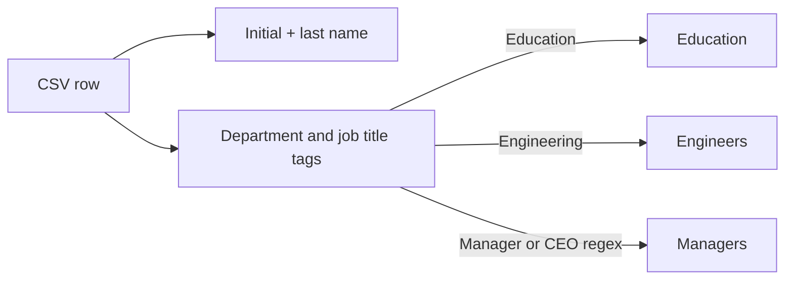

# Bulk IAM User Management

## Purpose
Creates IAM users in bulk from `users.csv`, generates initial console login profiles, and assigns users to IAM groups based on department and job title. It demonstrates `csvdecode`, `for_each`, filtering, `contains`, `regex`, and `can`.

## Architecture
```mermaid
flowchart TB
  CSV[users.csv\n26 employee records] --> D[csvdecode(file(...))]
  D --> U[local.users]
  U --> IAM[aws_iam_user.users\nfor_each by first_name]
  IAM --> LP[aws_iam_user_login_profile.users]
  IAM --> E[Education group\nDepartment = Education]
  IAM --> G[Engineers group\nDepartment = Engineering]
  IAM --> M[Managers group\nJobTitle matches Manager or CEO]
  ID[data.aws_caller_identity.name] --> O[account_id output]
  IAM --> N[user_names output]
  LP --> S[user_passwords output\nsensitive]
```

## Current Dataset And Rules

Each CSV row must contain `first_name`, `last_name`, `department`, and `job_title`. The IAM name is generated as the first initial plus last name, for example the row `Michael,Scott` becomes `MScott`; every user is placed under `/users/`.

| Group | Membership rule |
|---|---|
| `Education` | `Department == Education` |
| `Engineers` | `Department == Engineering` |
| `Managers` | `JobTitle` matches `Manager` or `CEO` |



## Files

- `users.csv`: source data for the employee records.
- `local.tf`: reads and decodes the CSV into `local.users`.
- `main.tf`: creates IAM users and login profiles.
- `groups.tf`: creates groups and calculated memberships.
- `data.tf`: reads the current AWS account identity.
- `outputs.tf`: exposes names, account ID, and a sensitive password-status map.
- `provider.tf`: AWS provider aliases `primary` and `secondary`, using `us-east-1` and `us-west-2` defaults.
- `backend.tf`: commented S3 backend template.

## Required AWS Permissions

The execution identity needs IAM permissions to create users, login profiles, groups, and group memberships, plus `sts:GetCallerIdentity`. IAM is account-global, so the two provider aliases do not create separate regional user sets. Use a dedicated lab account or tightly scoped deployment role.

## Run

Run from this folder only:

```powershell
terraform init
terraform fmt -check
terraform validate
terraform plan
terraform apply
terraform output
terraform destroy
```

After editing `users.csv`, run `terraform plan` and review renames carefully. Changing a person's `first_name` changes the `for_each` key and can replace the IAM user. Duplicate first names are also unsafe because the current map key is `first_name`.

## Security Notes

Login profiles create console passwords and require a password reset on first login. Never paste generated credentials into source control or chat. Terraform state can contain login-profile password material even when an output is marked sensitive; protect state with a private encrypted backend and restricted access. This example does not create access keys, permissions policies, MFA, or least-privilege group policies.

## Improvements For Production

- Use a stable employee ID as the `for_each` key.
- Validate CSV uniqueness and required fields before applying.
- Prefer IAM Identity Center for workforce access instead of long-lived IAM users.
- Add MFA and permission policies through groups or managed policy attachments.
- Remove the unused provider alias and use one explicit account/region configuration.
