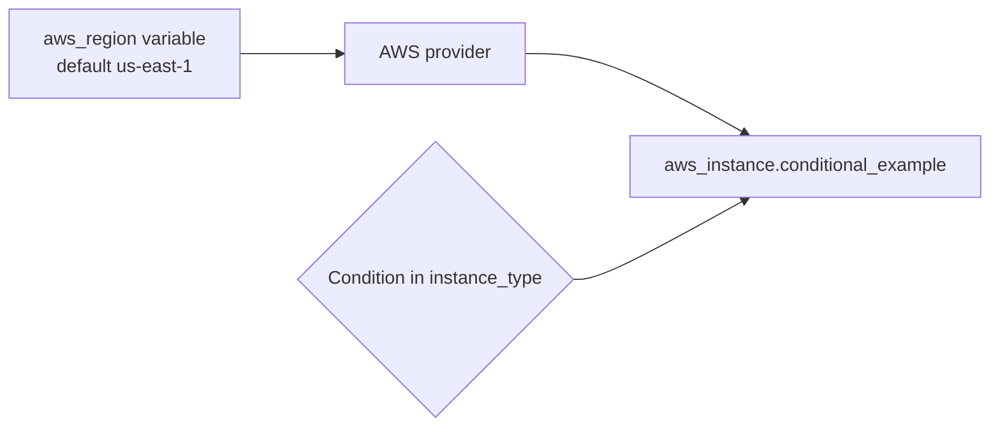

# Conditional Expressions

## Purpose
A focused example of selecting an EC2 instance type with a Terraform conditional expression. The folder also contains commented learning variants for dynamic blocks, splat expressions, and AMI selection.

## Architecture


## Files
- `main.tf`: active EC2 resource and commented expression examples.
- `variables.tf`: region and broader example inputs.
- `provider.tf`: AWS provider constraint `~> 5.0`.
- `backend.tf`, `locals.tf`, `outputs.tf`: backend/local/output learning surfaces; several blocks are commented.

## Run
```powershell
terraform init
terraform fmt -check
terraform validate
terraform plan
terraform apply
terraform destroy
```

The AMI is hard-coded as `ami-0ff8a91507f77f867`; verify that it exists in the selected region before applying. The active instance has no output, so inspect it with `terraform state list` or the AWS console.

## Learning Notes
A conditional has the shape `condition ? true_value : false_value`. Keep both branches type-compatible. Uncomment one experiment at a time and run `terraform validate` after each change.

## Caveats
This is a teaching example, not production infrastructure. The AMI is region-specific, many declared variables are unused, and the active resource has no output. Use a data source for a current AMI and add a security group, subnet, tags, and outputs for a real workload.
