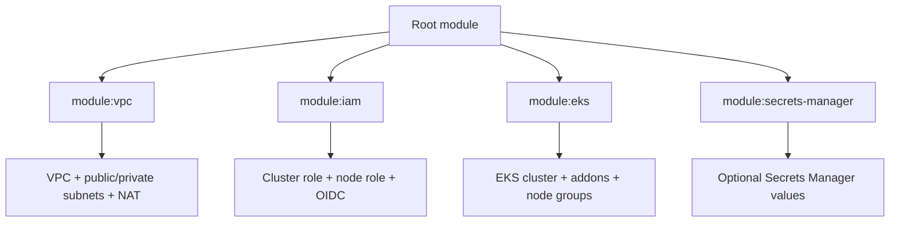

# Custom Modules for EKS

## Purpose
Builds a production-style EKS environment with reusable Terraform modules instead of a single large root file. The design separates VPC, IAM, cluster, and optional secret resources so each part can be understood and reused independently.

## Architecture


## Prerequisites
Create or confirm the required AWS setup before running this lab:
- Terraform installed and working
- AWS CLI configured with sufficient permissions
- kubectl installed for cluster validation
- Access to create VPC, IAM, EKS, KMS, and EC2 resources in your target region

## Run
```powershell
terraform init
terraform fmt -check
terraform validate
terraform plan
terraform apply
```

After the cluster is ready, connect your local kubectl:
```powershell
aws eks --region us-east-1 update-kubeconfig --name day20-eks
kubectl get nodes
kubectl get pods -A
```

When finished:
```powershell
kubectl delete svc --all
kubectl delete pods --all
terraform destroy
```

## What To Inspect
- `main.tf`: root module wiring, child module calls, and shared cluster settings
- `variables.tf`: cluster name, AWS region, VPC CIDR, and optional secret inputs
- `provider.tf`: AWS provider configuration and Terraform version requirement
- `outputs.tf`: cluster IDs, endpoint, role ARNs, and kubectl helper output
- `modules/vpc/main.tf`: public/private subnets, routing, NAT, and tagging
- `modules/iam/main.tf`: IAM roles and OIDC provider for IRSA
- `modules/eks/main.tf`: EKS cluster, add-ons, security groups, and node groups
- `modules/secrets-manager/main.tf`: optional secret resources for app configuration

## Caveats
This is a learning project, not a fully hardened production blueprint. EKS can take a long time to create, IAM and networking permissions must be scoped carefully, and real secrets should never be committed to Git. The demo keeps access simple for education; tighten it before production use.
