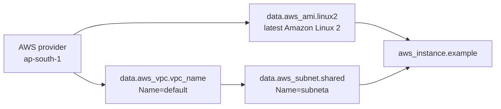

# Data Sources

## Purpose
Discovers infrastructure that already exists, then uses those values to launch an EC2 instance. It demonstrates lookup boundaries between Terraform-managed and externally managed resources.

## Architecture


## Prerequisites
Create or identify a VPC tagged `Name=default` and a subnet tagged `Name=subneta` in `ap-south-1`. Configure AWS credentials with read access to those resources and EC2 launch permissions.

## Run
```powershell
terraform init
terraform fmt -check
terraform validate
terraform plan
terraform apply
terraform destroy
```

## What To Inspect
- `main.tf`: VPC, subnet, and AMI data lookups followed by the EC2 resource.
- `provider.tf`: AWS provider `~> 5.0`, currently fixed to `ap-south-1`.
- `variables.tf`: shared example variables, many unused.
- `outputs.tf`: output examples are commented.

## Caveats
Data sources do not create the VPC or subnet. Exact tags are required, and the declared `aws_region` variable is not currently controlling the provider. Keep discovered IDs visible in a future output to make troubleshooting easier.
