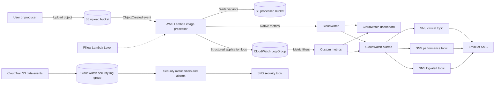

# End-to-End Observability on AWS

A Terraform-driven observability reference architecture for an event-driven image-processing workload on AWS. The primary implementation combines S3, AWS Lambda, CloudWatch Logs, CloudWatch native and custom metrics, metric filters, CloudWatch dashboards, CloudWatch alarms, SNS notifications, IAM least-privilege boundaries, and an optional CloudTrail-based S3 security-monitoring stack.

This project is designed to answer the operational questions that matter in production:

- Did an upload arrive and invoke the function?
- Is the function healthy, fast, and within its concurrency budget?
- Did image processing succeed from a business perspective?
- What kind of failure occurred: timeout, memory pressure, bad image, or S3 permission denial?
- Who is notified, through which severity channel, and how can the incident be investigated?
- Can suspicious S3 data-plane activity be detected independently through CloudTrail?

> **Repository status:** `aws-lamda-monitoring` is the primary deployable stack. `s3-security-monitoring.backup` is a separate backup/reference implementation for S3 data-event security monitoring and is documented as an optional extension.

## Architecture


### Signal flow



### Design principles

1. **Observe at multiple layers:** infrastructure signals, runtime signals, application logs, derived metrics, and business outcomes are collected together.
2. **Separate detection from notification:** CloudWatch evaluates conditions; SNS owns delivery channels and subscription management.
3. **Use structured, searchable evidence:** every Lambda execution logs a request ID and timing data, allowing an operator to correlate one invocation across steps.
4. **Keep alert intent separate:** critical failures, performance degradation, and log-pattern failures use different SNS topics.
5. **Make the stack reproducible:** Terraform creates the function, permissions, buckets, log group, metric filters, dashboard, alarms, topics, and subscriptions as one dependency graph.
6. **Prefer actionable alerts:** alarms target failure modes that have a concrete response, rather than forwarding every raw log line.

## What Is Deployed

### Primary stack: `aws-lamda-monitoring`

| Layer | AWS service or artifact | Purpose |
|---|---|---|
| Ingress | S3 upload bucket | Receives source images and emits `s3:ObjectCreated:*` events |
| Processing | Lambda, Python 3.12 | Downloads, transforms, and writes image variants |
| Dependency packaging | Lambda Layer with Pillow | Keeps the image-processing dependency outside the function package |
| Egress | S3 processed bucket | Stores compressed, converted, and thumbnail variants |
| Runtime logs | CloudWatch Log Group | Centralizes Lambda execution and application logs |
| Native telemetry | CloudWatch `AWS/Lambda` metrics | Tracks invocations, errors, throttles, duration, and concurrency |
| Derived telemetry | CloudWatch Logs metric filters | Converts meaningful log patterns into queryable metrics |
| Visualization | CloudWatch dashboard | Provides an operator view of health, performance, business success, and recent errors |
| Evaluation | CloudWatch alarms | Evaluates thresholds and publishes state changes |
| Notification | Three SNS topics | Routes critical, performance, and log-pattern alerts |
| Access control | Lambda IAM role and inline policy | Grants only the S3, Logs, and CloudWatch actions used by the function |
| Naming and tagging | `random_id` plus common tags | Avoids global S3 name collisions and supports resource ownership queries |

### Optional/reference stack: `s3-security-monitoring.backup`

This stack demonstrates an independent security-observability path:

- creates a monitored S3 bucket and a CloudTrail log bucket;
- enables S3 object-level read/write data events for the monitored bucket;
- delivers CloudTrail events to CloudWatch Logs through a dedicated IAM role;
- applies security metric filters for denied and restricted activity;
- evaluates security alarms and publishes to a dedicated SNS topic;
- creates `private/secret-file.txt` as a test object for controlled validation.

It is intentionally documented as a separate reference stack because it has its own variables, provider configuration, state, and notification flow.

## Image Processing Behavior

The Lambda handler in `aws-lamda-monitoring/lambda/lambda_function.py`:

1. reads S3 event records and URL-decodes each object key;
2. logs the request ID, source bucket, key, and source size;
3. emits a large-image warning for objects larger than 10 MiB;
4. downloads the object with `s3:GetObject`;
5. opens and normalizes the image with Pillow;
6. converts alpha or palette modes to RGB for JPEG compatibility;
7. resizes images larger than 4096 pixels on either axis;
8. creates five outputs: compressed JPEG, low-quality JPEG, WEBP, PNG, and a 300x300 thumbnail;
9. writes variants to the processed bucket with trace metadata such as original key, request ID, and processing time;
10. publishes success or failure metrics and returns a JSON result.

The function publishes the following custom metrics in the `ImageProcessor/Lambda` namespace:

| Metric | Meaning |
|---|---|
| `ProcessingTime` | End-to-end handler processing time in milliseconds |
| `ImagesProcessed` | Number of image records handled |
| `ProcessingSuccess` | Success indicator (`1` or `0`) |

All metrics published directly by the handler carry the `FunctionName` dimension. The success path emits `ProcessingSuccess`; the failure path emits `ProcessingFailure`. This distinction is useful for success-rate graphs and for separating a quiet period from an execution failure.

### Lambda function responsibilities

| Function or component | Responsibility | Why it matters operationally |
|---|---|---|
| `lambda_handler(event, context)` | Main S3-event entry point; loops through records, coordinates download, processing, upload, logging, and response generation | Defines the complete transaction boundary and preserves the AWS request ID for correlation |
| S3 event parsing | Reads bucket, URL-decodes object key, and captures source size | Prevents keys containing spaces or encoded characters from being mishandled |
| Download phase | Calls `s3:GetObject` and measures download latency | Separates storage/network latency from image transformation latency |
| Large-image guard | Logs `Large image detected` above 10 MiB | Provides an early performance signal before memory or duration pressure becomes an incident |
| `process_image(image_data, original_key, request_id)` | Opens, normalizes, resizes, and generates output variants | Keeps image transformation logic testable and separate from AWS orchestration |
| Image mode normalization | Converts RGBA, LA, palette, and other modes to RGB | Makes JPEG output reliable for PNGs and images with alpha channels |
| Dimension control | Resizes images above the 4096-pixel maximum dimension with LANCZOS resampling | Controls memory usage and protects the 60-second timeout budget |
| Variant generation | Creates compressed JPEG, low-quality JPEG, WEBP, PNG, and thumbnail outputs | Supports multiple delivery and quality use cases from one upload |
| Metadata writer | Stores original key, processor name, request ID, and processing time on output objects | Preserves audit and troubleshooting context in the data plane |
| `publish_metrics(...)` | Publishes processing time, image count, and success/failure custom metrics | Adds business and application signals not available in native Lambda metrics |
| Exception path | Logs stack trace, publishes failure telemetry, and returns HTTP-style status `500` | Makes failures visible without silently dropping the event context |

The handler deliberately catches metric-publication failures and logs a warning instead of failing an otherwise successful image-processing request. This avoids making observability delivery a single point of failure, while the warning remains searchable in CloudWatch Logs.

The Terraform log filters additionally define `LambdaErrors`, `ImageProcessingTime`, `SuccessfulProcesses`, `ImageSizeBytes`, and `S3AccessDenied` in the same namespace.

## Observability Coverage

### 1. Native Lambda metrics

The dashboard and alarms use AWS-managed Lambda metrics:

- **Invocations:** volume and trigger health.
- **Errors:** unhandled/runtime-level failures reported by Lambda.
- **Throttles:** capacity or concurrency-limit pressure.
- **Duration:** average, maximum, and p99 latency.
- **ConcurrentExecutions:** demand and scaling pressure.

### 2. Application logs

The handler writes operational events to `/aws/lambda/<function-name>`. Logs contain request IDs, source object details, download time, processing time, upload time, output variants, image dimensions, warnings, and stack traces. The configured log level defaults to `INFO` and can be changed through Terraform.

### 3. Log-derived custom metrics

Metric filters turn text patterns into CloudWatch time series:

- `LambdaErrors` detects `ERROR` log records.
- `ImageProcessingTime` extracts processing-time values.
- `SuccessfulProcesses` counts successful processing messages.
- `ImageSizeBytes` extracts source image sizes.
- `S3AccessDenied` detects S3 access failures.

A second log-alert module specializes in high-value failure signatures:

- `TimeoutErrors` for `Task timed out`;
- `MemoryErrors` for memory/runtime termination patterns;
- `ImageProcessingErrors` for Pillow and invalid-image failures;
- `S3PermissionErrors` for access-denied, 403, and related messages;
- `CriticalErrors` for `CRITICAL` application logs;
- `LargeImageWarnings` for oversized input images.

### 4. Dashboard

The generated dashboard contains:

- invocation, error, and throttle time series;
- average, maximum, and p99 Lambda duration;
- concurrent executions;
- custom errors versus successful processing;
- average and maximum image-processing time;
- average image size;
- a Logs Insights widget showing the 20 most recent errors.

The dashboard is optional through `enable_cloudwatch_dashboard`, and its URL is exposed as a Terraform output.

#### What “Lambda dashboard” means here

There are two complementary views:

1. **AWS Lambda console Monitoring tab:** AWS automatically provides the function's standard operational view, including invocation count, error count, duration, throttles, and concurrency-related information. It is useful for quick inspection of one function.
2. **Terraform-managed CloudWatch dashboard:** this project creates `<function-name>-monitoring` as a durable, team-shareable dashboard. It combines native Lambda metrics, application-derived metrics, and a Logs Insights query in one page. This is the project's primary operational dashboard.

The Terraform dashboard has seven widgets:

| Widget | Signals shown | Operational question |
|---|---|---|
| Lambda Invocations & Errors | `Invocations`, `Errors`, `Throttles`, five-minute period | Is traffic arriving, and is the runtime failing or throttling? |
| Lambda Duration | Average, maximum, and p99 `Duration`, five-minute period | Is latency approaching the configured timeout? |
| Concurrent Executions | Maximum `ConcurrentExecutions` | Is demand approaching the function's concurrency budget? |
| Custom Errors vs Success | `LambdaErrors` and `SuccessfulProcesses` | Are business-visible processing outcomes healthy? |
| Image Processing Time | Average and maximum `ImageProcessingTime` | Is transformation work, rather than invocation overhead, slowing down? |
| Image Size | Average `ImageSizeBytes` | Is input growth likely to increase memory, duration, or cost? |
| Recent Errors | Logs Insights query, latest 20 `ERROR` messages | What should the operator investigate right now? |

Each metric widget uses a five-minute period, while the most urgent log-pattern alarms evaluate one-minute periods. The dashboard is a situational-awareness surface; alarms remain the automated detection mechanism.

## Alerting Model

The active stack creates up to 13 alarms: seven general Lambda/business alarms plus six log-pattern alarms. The optional no-invocation alarm adds one more when enabled.

| Alarm family | Default condition | Severity / route |
|---|---|---|
| High error rate | More than 3 Lambda errors in the configured period | Critical SNS |
| High duration | Average duration above 45,000 ms | Performance SNS |
| Throttles | More than 5 throttles | Critical SNS |
| High concurrency | Maximum concurrency above 2 | Performance SNS |
| Log errors | At least 1 `ERROR` log event in 60 seconds | Critical SNS |
| No invocations | Fewer than 1 invocation for three 5-minute periods, optional | Performance SNS |
| Low success rate | Fewer than the configured successful-process count for two periods | Performance SNS |
| Timeout | At least one timeout signature in 60 seconds | Log-alert SNS |
| Memory | At least one memory failure signature in 60 seconds | Log-alert SNS |
| Image processing | More than 2 Pillow/invalid-image failures in 60 seconds | Log-alert SNS |
| S3 permissions | At least one S3 permission failure in 60 seconds | Log-alert SNS |
| Critical application error | At least one `CRITICAL` log event in 60 seconds | Log-alert SNS |
| Large image | Large-image warning pattern detected | Log-alert SNS |

Alarm thresholds are intentionally variables rather than hard-coded operational policy. Production values should be calibrated against traffic baselines, Lambda timeout, memory size, concurrency quotas, and the service-level objective.

### How an alarm becomes an incident

CloudWatch periodically aggregates the selected metric using the configured statistic (`Sum`, `Average`, or `Maximum`). It compares that datapoint with the threshold for the required number of evaluation periods. When the condition is met, the alarm changes to `ALARM` and publishes to its SNS topic. When the condition clears, configured `ok_actions` provide recovery visibility where enabled.

`notBreaching` handling for log-derived alarms prevents an absence of log matches from becoming an incident. The optional no-invocation alarm intentionally uses `breaching` for missing data because silence may indicate a broken S3 trigger. This is appropriate only for workloads where invocation is expected within that window.

### Alarm-by-alarm interpretation

| Alarm | Metric and evaluation | Meaning | First investigation |
|---|---|---|---|
| High error rate | Native `Errors`, `Sum`, more than 3 in one 60-second period | Lambda runtime or handler failures are increasing | Open recent logs and correlate request IDs |
| High duration | Native `Duration`, `Average`, above 45,000 ms for 2 periods | Execution is using 75% or more of the 60-second timeout budget | Compare download, processing, and upload timings |
| Throttles | Native `Throttles`, `Sum`, more than 5 in one period | Lambda rejected invocations because of concurrency limits | Inspect reserved/account concurrency and traffic burst |
| High concurrency | Native `ConcurrentExecutions`, `Maximum`, above configured threshold for 2 periods | Demand may exhaust capacity or increase throttling risk | Check traffic volume and concurrency quota |
| Log errors | Custom `LambdaErrors`, `Sum`, at least 1 in 60 seconds | Application emitted an `ERROR` log even if Lambda did not classify it as a runtime error | Read the exception and S3 operation context |
| No invocations | Native `Invocations`, fewer than 1 across three five-minute periods, optional | Expected traffic is not reaching Lambda | Check S3 notification, permission, bucket region, and producer |
| Low success rate | Custom `SuccessfulProcesses`, `Sum`, below expected count for 2 periods | Business processing output is below the configured baseline | Compare input volume with output objects and failure logs |
| Timeout | `TimeoutErrors`, at least 1 in 60 seconds | Lambda reached its hard timeout | Reduce input work, raise memory/timeout, or optimize processing |
| Memory | `MemoryErrors`, at least 1 in 60 seconds | Runtime was killed or reported memory pressure | Inspect image dimensions, memory setting, and peak usage |
| Image processing | `ImageProcessingErrors`, more than 2 in 60 seconds | Repeated invalid or unsupported image failures | Validate file content, format, and Pillow behavior |
| S3 permission | `S3PermissionErrors`, at least 1 in 60 seconds | Function cannot read input or write output | Review IAM resource ARNs and bucket policy |
| Critical application error | `CriticalErrors`, at least 1 in 60 seconds | Code explicitly emitted a critical event | Treat as a high-priority application incident |
| Large image | `LargeImageWarnings`, more than 5 in five minutes | Input profile may create performance or cost pressure | Review producer behavior and resize policy |

## Notification Routing

Terraform creates three SNS topics:

- `<project>-<environment>-critical-alerts`: errors and hard failures, with optional email and SMS;
- `<project>-<environment>-performance-alerts`: duration, concurrency, no-invocation, and business-success degradation;
- `<project>-<environment>-log-alerts`: timeout, memory, image, permission, critical-log, and size patterns.

Email subscriptions require confirmation from the recipient. The optional SMS subscription is attached only to the critical topic. CloudWatch is granted `SNS:Publish` through topic policies.

## Repository Layout

```text
End to End Observability/
|-- README.md                              # This architecture and operations guide
|-- Screenshot 2026-09-02 225244.png       # Architecture diagram
|-- aws-lamda-monitoring/                   # Primary Lambda observability stack
|   |-- lambda/lambda_function.py           # Image processing and telemetry
|   |-- terraform/
|   |   |-- main.tf                         # Root composition and dependencies
|   |   |-- variables.tf                    # Runtime and alert configuration
|   |   |-- outputs.tf                      # Names, ARNs, URLs, and test commands
|   |   |-- provider.tf                     # AWS and Terraform provider setup
|   |   |-- modules/
|   |   |   |-- s3_buckets/                 # Input/output bucket controls
|   |   |   |-- lambda_function/             # Function, IAM, and log group
|   |   |   |-- sns_notifications/           # Topics and subscriptions
|   |   |   |-- cloudwatch_metrics/           # Filters and dashboard
|   |   |   |-- cloudwatch_alarms/             # Native/custom alarms
|   |   |   `-- log_alerts/                   # Failure-pattern alarms
|   |   `-- scripts/                         # Layer build helpers
|   `-- QUICK_START.md                      # Short deployment checklist
`-- s3-security-monitoring.backup/          # Optional CloudTrail/S3 security reference
    |-- main.tf
    `-- modules/                             # Security SNS, ingestion, metrics, alarms
```

Terraform state files and generated ZIP artifacts may exist in local working directories. They are deployment artifacts, not substitutes for source configuration, and should be protected from accidental publication.

## Prerequisites

- AWS account with permission to create Lambda, S3, IAM, CloudWatch, SNS, CloudTrail, and related resources;
- AWS CLI configured for the target account and region;
- Terraform compatible with the provider lock file;
- Docker for building the Pillow layer using the supplied script;
- an email address for alert confirmation;
- optional E.164-format phone number for critical SMS alerts.

Verify the active identity before deployment:

```bash
aws sts get-caller-identity
terraform version
docker --version
```

## Deployment: Primary Lambda Stack

Run commands from `aws-lamda-monitoring/terraform`.

```bash
# Build the Pillow layer once, if it is not already available.
cd ../scripts
./build_layer_docker.sh
cd ../terraform

# Create local configuration from the example supplied by the stack.
cp terraform.tfvars.example terraform.tfvars

# Set at minimum: alert_email. Review region, environment, memory, timeout,
# retention, dashboard, and alarm thresholds before applying.
terraform init
terraform fmt -recursive
terraform validate
terraform plan
terraform apply
```

On Windows PowerShell, use `Copy-Item` instead of `cp` if needed. The repository includes PowerShell packaging helpers where available.

After apply:

1. confirm the three SNS email subscriptions;
2. obtain resource names with `terraform output`;
3. upload a test image to the upload bucket;
4. tail the Lambda log group;
5. open the dashboard URL;
6. verify the processed bucket contains all expected variants.

```bash
UPLOAD_BUCKET=$(terraform output -raw upload_bucket_name)
aws s3 cp ./sample.jpg "s3://${UPLOAD_BUCKET}/sample.jpg"
aws logs tail "$(terraform output -raw lambda_log_group_name)" --follow
terraform output cloudwatch_dashboard_url
aws s3 ls "s3://$(terraform output -raw processed_bucket_name)/" --recursive
```

## Validation and Incident Runbook

### Upload does not invoke Lambda

```bash
aws s3api get-bucket-notification-configuration --bucket "$UPLOAD_BUCKET"
aws lambda get-policy --function-name "$(terraform output -raw lambda_function_name)"
```

Check the S3 notification, Lambda permission source ARN, bucket region, and the Lambda log group.

### Function runs but produces an error

```bash
aws logs tail "$(terraform output -raw lambda_log_group_name)" --since 1h
aws cloudwatch describe-alarms --state-value ALARM
```

Use the request ID to correlate the download, transformation, and upload phases. The error-pattern alarms distinguish timeout, memory, invalid image, and S3 permission failures.

### No alert email arrives

Check the SNS subscription confirmation, spam folder, topic ARN attached to the alarm, and alarm state history. An unconfirmed SNS email subscription will not receive notifications.

### Test an alarm without generating a real failure

```bash
aws cloudwatch set-alarm-state \
  --alarm-name "<function-name>-high-error-rate" \
  --state-value ALARM \
  --state-reason "Controlled notification test"
```

Return the alarm to `OK` or allow CloudWatch to recalculate it after testing. Document notification tests separately from real incidents.

### S3 security-monitoring validation

From `s3-security-monitoring.backup`, initialize and apply only after reviewing its variables and provider configuration. Upload or access an object in the monitored bucket, then inspect the CloudTrail log group, metric filters, and security SNS topic. CloudTrail data events can have material cost at scale, so scope selectors deliberately.

## Configuration Reference

The primary stack defaults to:

| Variable | Default | Operational meaning |
|---|---:|---|
| `aws_region` | `us-east-1` | Deployment and dashboard region |
| `environment` | `dev` | Resource-name and tag environment |
| `project_name` | `image-processor` | Resource-name prefix |
| `lambda_runtime` | `python3.12` | Lambda runtime |
| `lambda_timeout` | `60` seconds | Maximum invocation time |
| `lambda_memory_size` | `1024` MB | Function memory and CPU allocation |
| `log_level` | `INFO` | Application logging verbosity |
| `log_retention_days` | `7` | CloudWatch Logs retention |
| `enable_s3_versioning` | `true` | Version protection for bucket objects |
| `enable_cloudwatch_dashboard` | `true` | Dashboard creation switch |
| `metric_namespace` | `ImageProcessor/Lambda` | Custom metric namespace |
| `error_threshold` | `3` | Native Lambda error threshold |
| `duration_threshold_ms` | `45000` | Performance warning threshold |
| `throttle_threshold` | `5` | Throttle threshold |
| `concurrent_executions_threshold` | `2` | Concurrency warning threshold |
| `log_error_threshold` | `1` | Log-error alarm threshold |
| `enable_no_invocation_alarm` | `false` | Optional trigger-health alarm |

Set `alert_email` before applying. Set `alert_sms` only when critical SMS delivery is required.

## Security and Production Hardening

The implementation already separates S3 read access to the upload bucket, S3 write access to the processed bucket, log publishing, and custom metric publishing. Before production adoption, review these controls:

- use a remote encrypted Terraform backend with state locking;
- never commit `terraform.tfstate`, backups, generated ZIPs, downloaded secrets, or real notification values;
- encrypt both S3 buckets with SSE-S3 or SSE-KMS and restrict public access explicitly;
- replace broad log and metric resource wildcards with account- and resource-scoped ARNs where practical;
- use separate AWS accounts or workspaces for development, staging, and production;
- increase log retention to match incident-response and compliance requirements;
- add dead-letter or retry handling for poison messages and repeated S3 events;
- consider reserved concurrency and a documented Lambda concurrency budget;
- add idempotency protection if duplicate S3 notifications can create duplicate outputs;
- validate image size, format, decompression behavior, and content before processing untrusted uploads;
- constrain CloudTrail selectors to required buckets and enable encryption, lifecycle, and access controls on trail storage;
- route SNS alerts into an incident-management system for acknowledgement, escalation, and audit history;
- calibrate thresholds with baseline traffic and attach runbooks to each production alarm.

## Cost and Reliability Notes

CloudWatch Logs ingestion and storage, custom metric publication, dashboard usage, SNS delivery, Lambda execution, S3 requests/storage, and CloudTrail S3 data events can all contribute to cost. The default seven-day retention and optional dashboard reduce development overhead, but production retention and CloudTrail coverage should be chosen deliberately. Alarm thresholds should avoid paging on expected batch silence unless the no-invocation alarm is explicitly enabled.

## Cleanup

Destroy the primary stack only after preserving any required evidence:

```bash
cd aws-lamda-monitoring/terraform
terraform destroy
```

The S3 modules may contain objects and use `force_destroy` in the reference security stack. Confirm retention, legal hold, and incident-evidence requirements before deleting buckets or logs.

## Operational Summary

This project implements a complete telemetry-to-action chain:

**event -> execution -> logs -> metrics -> visualization -> threshold evaluation -> routed notification -> investigation runbook**

That separation gives the platform team both fast detection and enough diagnostic context to explain what failed, where it failed, and what action should follow.
