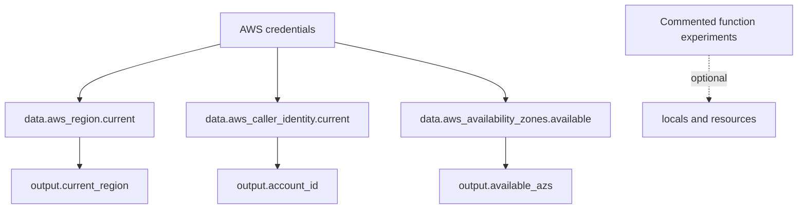

# Terraform Functions Workbook

## Purpose
An expression-functions laboratory covering string formatting, maps, collections, validation, files, timestamps, and cost calculations. Most examples are intentionally commented so they can be enabled and studied one at a time.

## Active Graph


## Run The Active Example
```powershell
terraform init
terraform fmt -check
terraform validate
terraform plan
terraform apply
terraform output
terraform destroy
```

Active outputs expose the current region, AWS account ID, and available availability zones. The provider uses `us-east-1` and requires AWS credentials even though no application infrastructure is created by default.

## Suggested Study Loop
1. Uncomment one local, variable validation, or resource example.
2. Run `terraform console` and evaluate the expression with representative values.
3. Run `terraform validate` and `terraform plan`.
4. Re-comment the experiment before trying the next one.

## Caveats
This is a workbook, not a deployable stack. Some examples read local files such as `config.json`; others demonstrate public ingress or sensitive values. Never use sample credentials, secrets, or broad security rules outside a disposable lab account.
