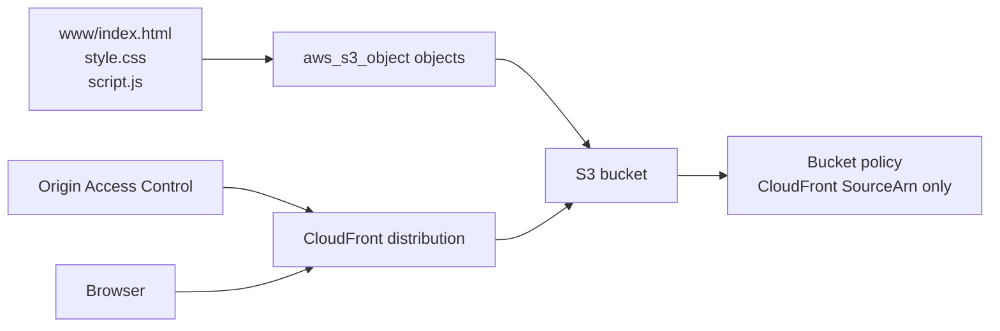

# Static Website: S3 + CloudFront

## Purpose
Publishes the local `www/` static site to Amazon S3 and serves it through CloudFront using Origin Access Control. The bucket is intended to remain private to direct public access.

## Architecture


## Prerequisites
Choose a globally unique `bucket_name`, configure AWS credentials, and confirm CloudFront service permissions. Distribution creation can take several minutes. The default region is `us-west-2`.

## Run
```powershell
terraform init
terraform fmt -check
terraform validate
terraform plan
terraform apply
terraform output
terraform destroy
```

The website assets are uploaded by the `aws_s3_object` resource using the `www/**/*` file set. The current outputs are commented, so retrieve the CloudFront domain from the AWS console or add an output for `domain_name` before applying.

## Files
- `main.tf`: bucket, public-access block, objects, OAC, policy, and distribution.
- `www/`: website content.
- `local.tf`: local naming/content calculations.
- `backend.tf`, `provider.tf`, `variables.tf`, `outputs.tf`: state/provider/input/output configuration.

## Production Gaps
There is no custom domain/TLS certificate, access logging, versioning, encryption policy, cache invalidation workflow, or custom error page. The bucket name default may already be taken. Review public access and policy behavior carefully before exposing a real site.
