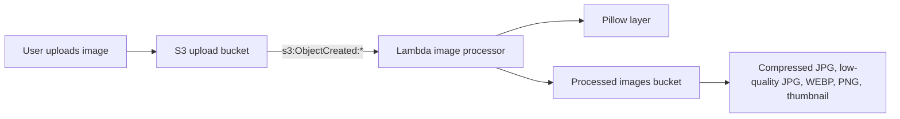

# Image Processing with Lambda

## Purpose
Creates an automated image-processing pipeline on AWS. When a file lands in the upload S3 bucket, S3 triggers a Lambda function that resizes and converts the image using Pillow, then stores processed variants in a separate destination bucket.

## Architecture


## Prerequisites
- Terraform CLI installed and authenticated with AWS credentials.
- Docker installed if you want to build the Lambda Pillow layer locally.
- A region with enough quota for Lambda, S3, and CloudWatch logs.
- A unique bucket name generated by the random suffix used in the project.

## Run
From this folder or the `terraform/` directory, use:

```powershell
cd scripts
bash build_layer_docker.sh
cd ../terraform
terraform init
terraform fmt -check
terraform validate
terraform plan
terraform apply
terraform output
terraform destroy
```

For a single scripted deployment, run:

```bash
./scripts/deploy.sh
```

The Lambda function reads uploaded image objects from the source bucket, creates multiple variants, and writes them to the processed bucket with metadata to track the original key.

## Files
- `lambda/lambda_function.py`: image processing logic and Lambda handler.
- `lambda/requirements.txt`: Python dependencies for the packaged lambda source.
- `scripts/build_layer_docker.sh`: builds the Pillow layer in a Linux container for Lambda compatibility.
- `scripts/deploy.sh`: end-to-end Terraform deployment helper.
- `terraform/main.tf`: bucket, IAM, layer, function, logging, and S3 event wiring.
- `terraform/provider.tf`: AWS provider and default tags.
- `terraform/variables.tf`: configuration values and naming defaults.
- `terraform/outputs.tf`: deployment outputs for bucket names and usage examples.

## Production Gaps
This is a learning-focused pipeline, not a hardened production design. There is no object lifecycle policy, version-retention workflow, dead-letter queue for failed jobs, event filtering by file type, or CloudWatch alarm setup. The upload bucket remains private by default, but the image-processing logic must still be reviewed for acceptable file size, content type, and security scanning before using real workloads.
