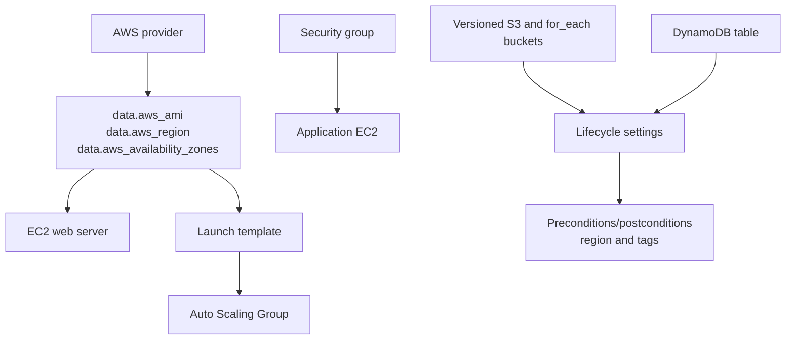

# Lifecycle Rules

## Purpose
Demonstrates Terraform lifecycle behavior and validation across several AWS resource types: EC2, S3, Auto Scaling, security groups, and DynamoDB.

## Resource Graph


## Run
```powershell
terraform init
terraform fmt -check
terraform validate
terraform plan
terraform apply
terraform output
terraform destroy
```

## Concepts To Observe
- `create_before_destroy` and replacement behavior.
- `ignore_changes` for selected attributes.
- Preconditions/postconditions for resource invariants.
- `for_each` for multiple buckets and typed variables.
- AMI/AZ data driving EC2 and ASG configuration.

## Important Warnings
This folder is a broad demonstration, not production-ready infrastructure. SSH, HTTP, and HTTPS rules are broad; the sample database password is plaintext and unused; and `prevent_destroy` is commented out. The ASG uses availability zones without an explicit subnet design. Review every planned resource and destroy promptly to avoid AWS charges.
