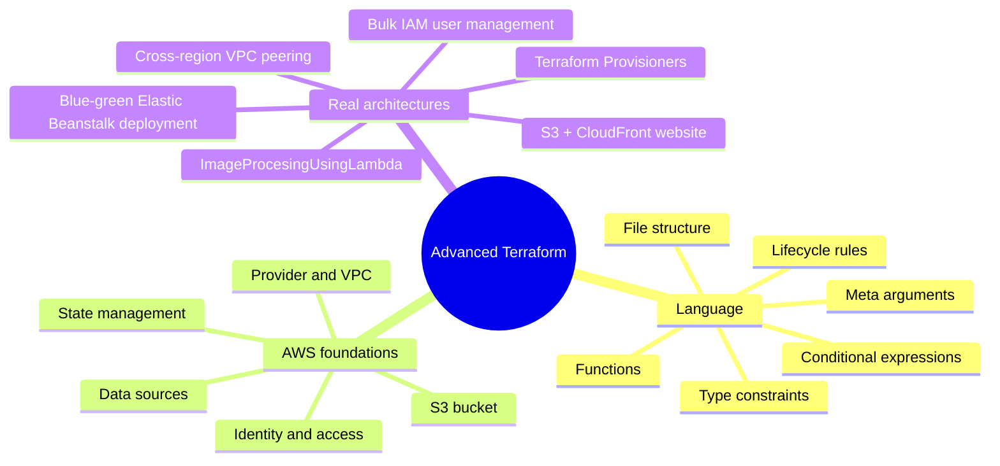
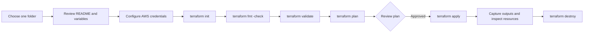

# Advanced Terraform

This repository is a collection of independent Terraform exercises and AWS infrastructure examples. Each subfolder is its own Terraform root module: initialize, plan, apply, and destroy from inside that folder rather than from the repository root.

**Note: All the Readme in all folders has been made with Github Copilot, So thier might be some errors or misinterpretations.

## What This Repo Covers



## Project Map

| Project | Main concept | Infrastructure footprint |
|---|---|---|
| [Blue-Green Deployment Using Elastic Beanstalk](Blue-Green%20Deployment%20Using%20Elastic%20Beanstalk/README.md) | Zero-downtime release promotion and rollback | Elastic Beanstalk application with Blue/Green environments, ALBs, IAM roles, and S3 artifacts |
| [Conditional Expressions](Conditional%20Expressions/README.md) | Conditional values | Optional EC2 instance |
| [Bulk IAM User Management](Bulk%20IAM%20User%20Management/README.md) | CSV-driven IAM automation | 26 IAM users, login profiles, and groups |
| [Data source](Data%20source/README.md) | Discover existing AWS resources | VPC/subnet/AMI lookup and EC2 |
| [Functions](Functions/README.md) | Terraform expression functions | Region, identity, and AZ data sources |
| [Hosting website on S3 CloudFront](Hosting_website_on_s3_cloudfront/README.md) | Static website delivery | S3, CloudFront, OAC, bucket policy, objects |
| [Image Processing with Lambda](ImageProcesingUsingLambda/README.md) | Event-driven image transformation | S3 upload bucket, Lambda, Pillow layer, processed bucket, CloudWatch logs |
| [Lifecycle Rules](Lifecycle%20Rules/README.md) | Lifecycle and validation rules | EC2, S3, ASG, security group, DynamoDB |
| [Meta Arguments](Meta%20Arguments/README.md) | `count` | Two S3 buckets |
| [S3 Terraform](S3%20Terraform/README.md) | First AWS resource | One S3 bucket |
| [Terraform AWS Provider](Terraform%20AWS%20Provider/README.md) | Provider and resource basics | One VPC |
| [Terraform filestructure](Terraform%20filestructure/README.md) | Files, locals, outputs, naming | Random suffix and S3 bucket |
| [Terraform Provisioners](Terraform%20Provisioners/README.md) | Bootstrapping with `local-exec`, `remote-exec`, and `file` | EC2 instance with SSH-based provisioning |
| [Terraform StateFile Management](Terraform%20StateFile%20Management/README.md) | Remote state and locking | S3 backend plus S3 bucket |
| [Terraform Type Constraints](Terraform%20Type%20Constraints/README.md) | Typed inputs and `count` | EC2 and security group rules |
| [VPC Peering Terraform](VPC%20Peering%20Terraform/README.md) | Cross-region networking | Two VPCs, peering, routes, and EC2 |

## How To Run An Example



Run these commands from the selected project directory:

```powershell
terraform init
terraform fmt -check
terraform validate
terraform plan
terraform apply
terraform output
terraform destroy
```

## Requirements

- Terraform CLI compatible with the provider version in the selected folder (`~> 5.0` or `~> 6.0`).
- An AWS account and credentials with only the permissions required by the exercise.
- A region-specific AMI, key pair, or pre-existing tagged resource where that folder's README says one is required.
- A globally unique S3 bucket name for every S3 example.

## State, Cost, And Security

The examples are intentionally educational and are not production blueprints. Some folders contain checked-in state files; state can reveal resource details and sensitive values, so do not commit real credentials or production state. Several examples intentionally use broad network access, hard-coded names, public test endpoints, or plaintext sample values. Review the plan, restrict CIDRs, enable encryption/versioning, and use a dedicated backend key before real use.

Some backend examples point at the same bucket/key (`dev/terraform.tfstate`). Never initialize multiple unrelated folders against one state key: use a unique key per project, for example `learning/vpc-peering/terraform.tfstate`.

## Suggested Learning Path

1. [Terraform AWS Provider](Terraform%20AWS%20Provider/README.md) and [S3 Terraform](S3%20Terraform/README.md)
2. [Terraform filestructure](Terraform%20filestructure/README.md), [Type Constraints](Terraform%20Type%20Constraints/README.md), and [Meta Arguments](Meta%20Arguments/README.md)
3. [Conditional Expressions](Conditional%20Expressions/README.md), [Functions](Functions/README.md), and [Data source](Data%20source/README.md)
4. [Bulk IAM User Management](Bulk%20IAM%20User%20Management/README.md), [Lifecycle Rules](Lifecycle%20Rules/README.md), and [StateFile Management](Terraform%20StateFile%20Management/README.md)
5. [Hosting website on S3 CloudFront](Hosting_website_on_s3_cloudfront/README.md), [Image Processing with Lambda](ImageProcesingUsingLambda/README.md), and [Blue-Green Deployment](Blue-Green%20Deployment%20Using%20Elastic%20Beanstalk/README.md)
6. [Terraform Provisioners](Terraform%20Provisioners/README.md) for resource bootstrapping and remote execution patterns
7. [VPC Peering](VPC%20Peering%20Terraform/README.md) and [Data source](Data%20source/README.md) for networking and discovery patterns
