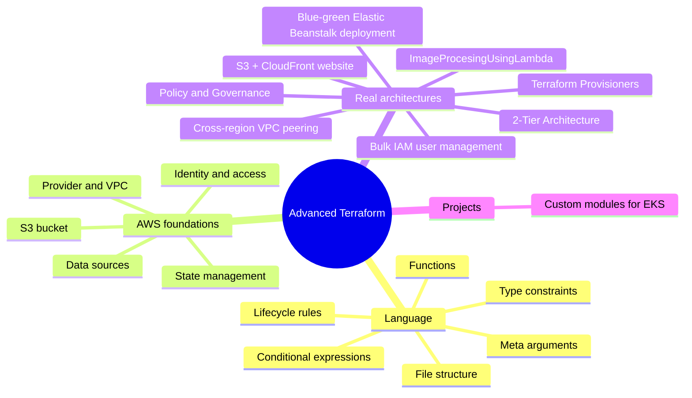
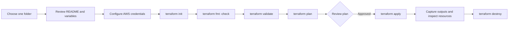

# Advanced Terraform - AWS Infrastructure as Code

A comprehensive collection of production-ready Terraform projects demonstrating AWS services, architectural patterns, infrastructure best practices, and governance. This repository serves as both a learning resource and a reference implementation guide.

**Note**: All READMEs in all folders have been created/updated for clarity. Each subfolder is an independent Terraform root module—initialize, plan, apply, and destroy from inside that folder rather than from the repository root.

## 🗺️ Repository Overview



## 📚 Complete Project Index

| # | Project | Concept | Complexity | Infrastructure |
|---|---------|---------|------------|-----------------|
| 1 | [Blue-Green Deployment](Blue-Green%20Deployment%20Using%20Elastic%20Beanstalk/) | Zero-downtime deployments | ⭐⭐⭐ | EB, ALB, Auto Scaling, S3 |
| 2 | [Conditional Expressions](Conditional%20Expressions/) | Conditional logic | ⭐ | Optional EC2 instance |
| 3 | [Bulk IAM User Management](Bulk%20IAM%20User%20Management/) | CSV automation | ⭐⭐ | 26 IAM users, groups, policies |
| 4 | [Custom Modules for EKS](Custom%20Modules%20for%20EKS/) | Reusable modules | ⭐⭐⭐⭐ | VPC, EKS, node groups, add-ons |
| 5 | [Data Source](Data%20source/) | Resource discovery | ⭐⭐ | VPC, subnet, AMI, EC2 |
| 6 | [Functions](Functions/) | Terraform functions | ⭐⭐ | Data sources, computed values |
| 7 | [S3 + CloudFront Website](Hosting_website_on_s3_cloudfront/) | Static site hosting | ⭐⭐⭐ | S3, CloudFront, OAC, certificates |
| 8 | [Image Processing Lambda](ImageProcesingUsingLambda/) | Serverless pipelines | ⭐⭐⭐ | S3, Lambda, Pillow layer, CloudWatch |
| 9 | [Lifecycle Rules](Lifecycle%20Rules/) | Lifecycle management | ⭐⭐ | EC2, S3, ASG, security groups |
| 10 | [Meta Arguments](Meta%20Arguments/) | count, for_each | ⭐⭐ | Multiple S3 buckets |
| 11 | [Policy and Governance](Policy%20and%20governance/) | AWS Config, IAM policies | ⭐⭐⭐ | AWS Config, IAM, S3, compliance |
| 12 | [2-Tier Architecture](2-Tier%20Architecture/) | Web + Database tiers | ⭐⭐⭐ | VPC, EC2, RDS, Security Groups |
| 13 | [S3 Terraform](S3%20Terraform/) | First AWS resource | ⭐ | Single S3 bucket |
| 14 | [Terraform AWS Provider](Terraform%20AWS%20Provider/) | Provider config | ⭐ | Basic setup |
| 15 | [Terraform File Structure](Terraform%20filestructure/) | Project organization | ⭐⭐ | Best practices |
| 16 | [Terraform Provisioners](Terraform%20Provisioners/) | Post-deployment config | ⭐⭐⭐ | EC2, scripts, file provisioners |
| 17 | [State File Management](Terraform%20StateFile%20Management/) | Remote state | ⭐⭐ | S3 backend, state locking |
| 18 | [Type Constraints](Terraform%20Type%20Constraints/) | Variable validation | ⭐⭐ | Type checking, complex types |
| 19 | [VPC Peering](VPC%20Peering%20Terraform/) | Multi-VPC networking | ⭐⭐⭐ | VPCs, peering, routes |

## 🎓 Learning Path

### Beginner (⭐)
1. Start with [S3 Terraform](S3%20Terraform/) - Create your first AWS resource
2. Learn about [Terraform AWS Provider](Terraform%20AWS%20Provider/) - Basic setup
3. Explore [Conditional Expressions](Conditional%20Expressions/) - Logic in Terraform

### Intermediate (⭐⭐)
4. Study [Functions](Functions/) - Terraform expression functions
5. Dive into [Meta Arguments](Meta%20Arguments/) - count and for_each loops
6. Master [Lifecycle Rules](Lifecycle%20Rules/) - Resource lifecycle management
7. Understand [Data Source](Data%20source/) - Querying AWS resources
8. Learn [Terraform File Structure](Terraform%20filestructure/) - Project organization

### Advanced (⭐⭐⭐ to ⭐⭐⭐⭐)
9. Deploy [VPC Peering](VPC%20Peering%20Terraform/) - Multi-VPC networking
10. Implement [Bulk IAM User Management](Bulk%20IAM%20User%20Management/) - Automation at scale
11. Build [Hosting Website on S3 + CloudFront](Hosting_website_on_s3_cloudfront/) - Content delivery
12. Create [Terraform Provisioners](Terraform%20Provisioners/) - Post-deployment configuration
13. Develop [Custom Modules for EKS](Custom%20Modules%20for%20EKS/) - Reusable infrastructure
14. Setup [Policy and Governance](Policy%20and%20governance/) - Security and compliance
15. Deploy [2-Tier Architecture](2-Tier%20Architecture/) - Real-world web application architecture
16. Architect [Image Processing Lambda](ImageProcesingUsingLambda/) - Serverless pipelines
17. Deploy [Blue-Green Deployment](Blue-Green%20Deployment%20Using%20Elastic%20Beanstalk/) - Production patterns

## 🚀 Getting Started

### Prerequisites

```bash
# Check versions
terraform --version
aws --version

# Ensure you're on Terraform >= 1.0
# AWS CLI configured with credentials
```

### Quick Start for Any Project

```bash
# Navigate to project directory
cd "Project-Name"

# Initialize Terraform (downloads providers)
terraform init

# Validate configuration
terraform validate

# Preview infrastructure changes
terraform plan -out=tfplan

# Apply the configuration
terraform apply tfplan

# Inspect outputs
terraform output

# Clean up resources
terraform destroy
```

## 📁 Directory Structure

```
terraform/
├── README.md                                    # This file
├── terraform.tfstate                            # Local state (for root reference)
│
├── Blue-Green Deployment Using Elastic Beanstalk/
│   ├── main.tf
│   ├── variables.tf
│   ├── outputs.tf
│   ├── README.md
│   └── ...
│
├── Bulk IAM User Management/
│   ├── main.tf
│   ├── variables.tf
│   ├── users.csv                                # CSV data source
│   └── ...
│
├── Policy and governance/
│   ├── main.tf                                  # S3 bucket setup
│   ├── config.tf                                # AWS Config rules
│   ├── iam.tf                                   # IAM policies
│   ├── variables.tf
│   ├── outputs.tf
│   ├── README.md
│   └── ...
│
└── [Other project folders]
```

## 🔑 Key Concepts Covered

### Terraform Language Features
- ✅ Variables, outputs, locals
- ✅ Conditional logic (if/else, ternary)
- ✅ For loops and for_each
- ✅ Functions (string, list, map, etc.)
- ✅ Type constraints and validation
- ✅ Splat expressions
- ✅ Dynamic blocks
- ✅ Lifecycle management

### AWS Services
- ✅ VPC & Networking (VPC peering, subnets, security groups)
- ✅ Compute (EC2, Auto Scaling, Elastic Beanstalk, EKS, Lambda)
- ✅ Storage (S3 with encryption, versioning, policies)
- ✅ CDN (CloudFront with OAC)
- ✅ Identity & Access (IAM users, roles, policies)
- ✅ Governance (AWS Config, compliance rules)
- ✅ Databases (DynamoDB)
- ✅ Monitoring (CloudWatch)

### Best Practices
- ✅ Remote state management
- ✅ State locking and team workflows
- ✅ Modular architecture
- ✅ Variable validation
- ✅ Output organization
- ✅ Resource tagging strategy
- ✅ Encryption and security
- ✅ Cost optimization

## 🛠️ Essential Commands

```bash
# Workspace management
terraform init              # Initialize working directory
terraform validate          # Check syntax and validity
terraform fmt               # Format code (auto-indentation)
terraform fmt -recursive    # Format all files recursively

# Planning and applying
terraform plan              # Show planned changes
terraform plan -out=tfplan  # Save plan to file
terraform apply             # Apply changes
terraform apply tfplan      # Apply from saved plan
terraform destroy           # Remove all resources

# Inspection
terraform show              # Show current state
terraform show -json        # Output state as JSON
terraform output            # Display output values
terraform output -json      # JSON formatted outputs
terraform state list        # List resources in state
terraform state show <resource>  # Show specific resource

# Advanced
terraform import <resource> <id>  # Import existing AWS resource
terraform taint <resource>        # Mark resource for replacement
terraform untaint <resource>      # Unmark resource
terraform console                 # Interactive REPL
terraform graph                   # Dependency graph
terraform refresh                 # Sync local state with AWS
```

## 🔐 Security Considerations

### Before Deploying

- ✅ Review all `terraform plan` output carefully
- ✅ Never commit AWS credentials to version control
- ✅ Use AWS Secrets Manager or Parameter Store for sensitive values
- ✅ Enable state file encryption for remote backends
- ✅ Implement least privilege IAM policies
- ✅ Use separate AWS accounts for dev/staging/prod

### Configuration

```hcl
# Use variables for sensitive data
variable "db_password" {
  type      = string
  sensitive = true
}

# Remote state with encryption
terraform {
  backend "s3" {
    bucket         = "my-terraform-state"
    key            = "prod/terraform.tfstate"
    region         = "us-east-1"
    encrypt        = true
    dynamodb_table = "terraform-locks"
  }
}
```

## 📊 Project Maturity Levels

| Level | Characteristics |
|-------|-----------------|
| **Beginner Friendly** | Single file, basic resources, clear comments |
| **Intermediate** | Multiple files, variables, basic modules |
| **Production Ready** | Remote state, dynamic blocks, comprehensive validation |
| **Enterprise** | Custom modules, testing, CI/CD integration |

## 💰 Cost Awareness

Each project has varying AWS costs:
- ⭐ Projects: ~$1-5/month (if left running)
- ⭐⭐ Projects: ~$5-20/month
- ⭐⭐⭐ Projects: ~$20-100/month
- ⭐⭐⭐⭐ Projects: ~$50-200+/month

**Always run `terraform destroy` to avoid unexpected charges!**

## 📖 Additional Learning Resources

### Official Documentation
- [Terraform Official Docs](https://www.terraform.io/docs)
- [AWS Provider Documentation](https://registry.terraform.io/providers/hashicorp/aws/latest/docs)
- [Terraform AWS Best Practices](https://docs.aws.amazon.com/whitepapers/latest/best-practices-for-terraform-aws/)

### AWS Services
- [AWS Config Guide](https://docs.aws.amazon.com/config/)
- [IAM Best Practices](https://docs.aws.amazon.com/IAM/latest/UserGuide/best-practices.html)
- [VPC Peering Guide](https://docs.aws.amazon.com/vpc/latest/peering/)
- [EKS Best Practices](https://aws.github.io/aws-eks-best-practices/)

### Recommended Learning Order
1. HashiCorp Terraform Associate Certification (beginner)
2. AWS Certified Cloud Practitioner
3. AWS Solutions Architect Associate

## 🤝 Tips for Using This Repository

1. **Fork & Clone**: Create your own copy for experimentation
2. **Start Small**: Begin with ⭐ projects to understand basics
3. **Read Carefully**: Every project has detailed READMEs
4. **Modify Responsibly**: Change variables and review impact
5. **Practice Destroy**: Always clean up resources after testing
6. **Version Control**: Track your changes with Git
7. **Review State**: Always check `terraform show` before destroying

## ⚠️ Important Warnings

🚨 **NEVER** commit to version control:
- AWS credentials or keys
- Sensitive values or secrets
- terraform.tfstate files
- .tfvars files with real values

🚨 **ALWAYS** review:
- `terraform plan` output before applying
- Resource deletion warnings
- Cost implications

🚨 **REMEMBER** to:
- Run `terraform destroy` when finished
- Monitor AWS billing
- Keep Terraform and providers updated

## 🔄 Repository Maintenance

- Last Updated: 2026-09-02
- Terraform Version: >= 1.0
- AWS Provider Version: Latest (4.x+)
- Actively Maintained ✅

---

**Happy Infrastructure Coding! 🎉**
| [Terraform AWS Provider](Terraform%20AWS%20Provider/README.md) | Provider and resource basics | One VPC |
| [Terraform filestructure](Terraform%20filestructure/README.md) | Files, locals, outputs, naming | Random suffix and S3 bucket |
| [Terraform Provisioners](Terraform%20Provisioners/README.md) | Bootstrapping with `local-exec`, `remote-exec`, and `file` | EC2 instance with SSH-based provisioning |
| [Terraform StateFile Management](Terraform%20StateFile%20Management/README.md) | Remote state and locking | S3 backend plus S3 bucket |
| [Terraform Type Constraints](Terraform%20Type%20Constraints/README.md) | Typed inputs and `count` | EC2 and security group rules |
| [VPC Peering Terraform](VPC%20Peering%20Terraform/README.md) | Cross-region networking | Two VPCs, peering, routes, and EC2 |

## How To Run An Example



Run these commands from the selected project directory:

```powershell
terraform init
terraform fmt -check
terraform validate
terraform plan
terraform apply
terraform output
terraform destroy
```

## Requirements

- Terraform CLI compatible with the provider version in the selected folder (`~> 5.0` or `~> 6.0`).
- An AWS account and credentials with only the permissions required by the exercise.
- A region-specific AMI, key pair, or pre-existing tagged resource where that folder's README says one is required.
- A globally unique S3 bucket name for every S3 example.

## State, Cost, And Security

The examples are intentionally educational and are not production blueprints. Some folders contain checked-in state files; state can reveal resource details and sensitive values, so do not commit real credentials or production state. Several examples intentionally use broad network access, hard-coded names, public test endpoints, or plaintext sample values. Review the plan, restrict CIDRs, enable encryption/versioning, and use a dedicated backend key before real use.

Some backend examples point at the same bucket/key (`dev/terraform.tfstate`). Never initialize multiple unrelated folders against one state key: use a unique key per project, for example `learning/vpc-peering/terraform.tfstate`.

## Suggested Learning Path

1. [Terraform AWS Provider](Terraform%20AWS%20Provider/README.md) and [S3 Terraform](S3%20Terraform/README.md)
2. [Terraform filestructure](Terraform%20filestructure/README.md), [Type Constraints](Terraform%20Type%20Constraints/README.md), and [Meta Arguments](Meta%20Arguments/README.md)
3. [Conditional Expressions](Conditional%20Expressions/README.md), [Functions](Functions/README.md), and [Data source](Data%20source/README.md)
4. [Bulk IAM User Management](Bulk%20IAM%20User%20Management/README.md), [Lifecycle Rules](Lifecycle%20Rules/README.md), and [StateFile Management](Terraform%20StateFile%20Management/README.md)
5. [Hosting website on S3 CloudFront](Hosting_website_on_s3_cloudfront/README.md), [Image Processing with Lambda](ImageProcesingUsingLambda/README.md), and [Blue-Green Deployment](Blue-Green%20Deployment%20Using%20Elastic%20Beanstalk/README.md)
6. [Custom Modules for EKS](Custom%20Modules%20for%20EKS/README.md) for reusable module design and production-style composition
7. [Terraform Provisioners](Terraform%20Provisioners/README.md) for resource bootstrapping and remote execution patterns
8. [VPC Peering](VPC%20Peering%20Terraform/README.md) and [Data source](Data%20source/README.md) for networking and discovery patterns
