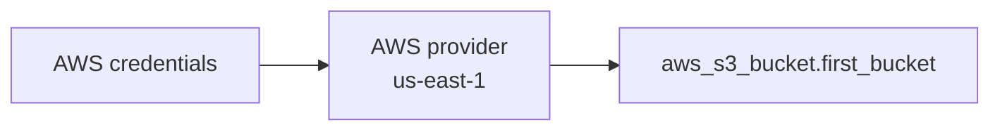

# S3 Terraform

## Purpose
Minimal first-resource example: create one Amazon S3 bucket with the AWS provider.

## Architecture


## Run
```powershell
terraform init
terraform fmt -check
terraform validate
terraform plan
terraform apply
terraform destroy
```

The bucket name is hard-coded in `main.tf` and must be globally unique. No variables, outputs, backend, encryption, versioning, or public-access controls are configured.

## Learning Goal
Use this as the smallest complete Terraform loop: provider initialization, resource graph construction, plan review, apply, state inspection, and destroy. For a real bucket, add a variable, tags, default encryption, versioning, and an explicit public-access block.
