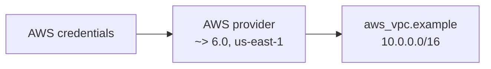

# Terraform AWS Provider

## Purpose
Introduces the AWS provider and a basic VPC resource. It creates only the VPC boundary; it is not a complete network.

## Architecture


## Run
```powershell
terraform init
terraform fmt -check
terraform validate
terraform plan
terraform apply
terraform destroy
```

## Expected Result
One VPC is created with CIDR `10.0.0.0/16`. There are no subnets, route tables, internet gateway, NAT gateway, security groups, tags, or outputs, so the VPC is an isolated foundation for learning.

Destroy it after the exercise to avoid retaining unused infrastructure. AWS credentials need VPC permissions and the selected account/region must be correct.
