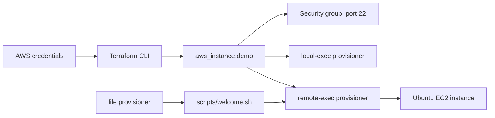

# Terraform Provisioners

## Purpose
This lab demonstrates how Terraform provisioners can bootstrap resources after creation. It focuses on three patterns: local execution, remote execution over SSH, and copying a script before running it on the instance. Each example is intentionally grouped in the same configuration so you can enable one pattern at a time and observe the behavior clearly.

## Architecture


## Prerequisites
Before running the demo, make sure you have:
- Terraform installed and initialized
- AWS CLI configured with valid credentials
- An EC2 key pair already created in the target region
- SSH access allowed on port 22 from your IP

Create the key pair if needed:
```powershell
aws ec2 create-key-pair --key-name terraform-demo-key `
  --query 'KeyMaterial' --output text > terraform-demo-key.pem
chmod 400 terraform-demo-key.pem
```

## Run The Active Example
```powershell
terraform init
terraform fmt -check
terraform validate
terraform plan
terraform apply `
  -var='key_name=terraform-demo-key' `
  -var='private_key_path=./terraform-demo-key.pem'
```

To try the next provisioner pattern, uncomment the desired block in `main.tf`, then recreate the instance:
```powershell
terraform taint aws_instance.demo
terraform apply `
  -var='key_name=terraform-demo-key' `
  -var='private_key_path=./terraform-demo-key.pem'
```

When you are done:
```powershell
terraform destroy `
  -var='key_name=terraform-demo-key' `
  -var='private_key_path=./terraform-demo-key.pem'

aws ec2 delete-key-pair --key-name terraform-demo-key
Remove-Item terraform-demo-key.pem
```

## What To Inspect
- `main.tf`: EC2 resource, SSH connection block, and the commented provisioner examples
- `variables.tf`: key name, SSH user, and private key path inputs
- `scripts/welcome.sh`: sample shell script used by the file + remote-exec demo
- `DEMO_GUIDE.md`: end-to-end walkthrough of each provisioner pattern
- `SIMPLIFIED_DEMO.md`: quick-start helper for the lab

## Demo Flow
1. Enable `local-exec` and observe a command run on the machine executing Terraform.
2. Enable `remote-exec` and confirm commands execute on the EC2 instance over SSH.
3. Enable `file` plus `remote-exec` and copy a script before executing it on the remote host.

## Caveats
- Provisioners run mainly during resource creation, not on every apply.
- A failed provisioner can leave the resource tainted and trigger recreation on the next apply.
- Use `terraform taint` or `-replace` when you need to re-run the provisioning logic.
- Prefer `user_data`, `cloud-init`, or configuration management tools for production-grade bootstrap logic.
- Keep scripts idempotent and do not hardcode sensitive values into provisioner commands.

## Suggested Study Loop
1. Uncomment only one provisioner block at a time.
2. Run `terraform apply` and inspect the output in the terminal.
3. Verify the result on the EC2 instance or in the local environment.
4. Comment the block before moving to the next example.

## Best Use Cases
- `local-exec`: local automation, notifications, and orchestration
- `remote-exec`: quick instance bootstrapping and configuration
- `file` + `remote-exec`: script delivery and remote execution patterns

This is a teaching-oriented lab, not the preferred production pattern for full lifecycle automation. The goal is to understand the mechanics and trade-offs before switching to more declarative infrastructure setup tools.
