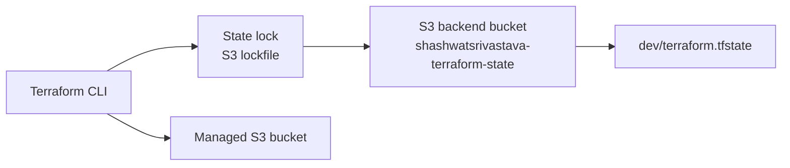

# Terraform State File Management

## Purpose
Demonstrates an S3 remote backend with encryption and Terraform's native lockfile, alongside a simple S3 resource.

## State Flow


## Bootstrap Requirement
The backend bucket must already exist. Terraform cannot create the backend bucket from the same configuration before `terraform init`; bootstrap it separately and then initialize this folder.

## Run
```powershell
terraform init
terraform fmt -check
terraform validate
terraform plan
terraform apply
terraform state list
terraform destroy
```

The backend uses encryption and native locking. Keep the state bucket private, enable bucket versioning, and restrict access to the deployment role.

## Critical Caveat
This folder currently shares the `dev/terraform.tfstate` key with `Meta Arguments`, `Terraform filestructure`, and `Terraform Type Constraints`. That can mix unrelated resources and cause destructive plans. Give every root module its own key before running multiple examples.
