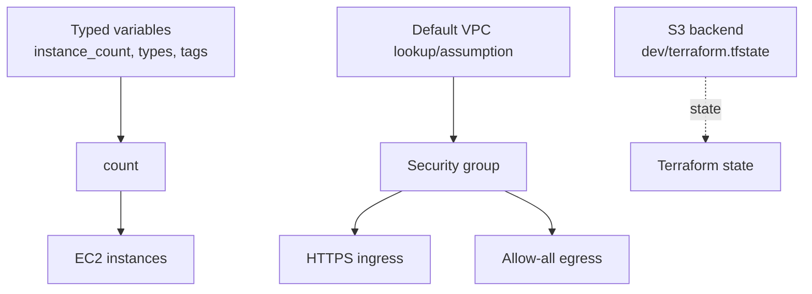

# Terraform Type Constraints

## Purpose
Demonstrates typed variables, booleans, collections, `count`, and standalone security-group rules. `terraform.tfvars` currently sets `instance_count = 1`.

## Resource Graph


## Run
```powershell
terraform init
terraform fmt -check
terraform validate
terraform plan
terraform apply
terraform destroy
```

## What To Learn
Type constraints make module contracts explicit: strings, numbers, booleans, lists, maps, and objects. Change `instance_count` in `terraform.tfvars`, inspect the plan, and observe indexed resources.

## Caveats
The configuration relies on an AMI lookup and a default VPC. Review the current `aws_instance` arguments because `region` is not an EC2 resource argument and the provider is not configured from the `region` variable. The security rules are broad and the backend key is shared with unrelated examples; use a unique key and restricted CIDRs in real work.
