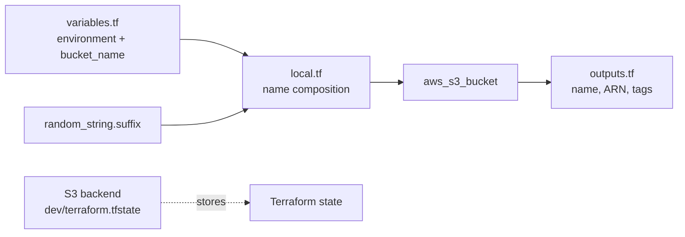

# Terraform File Structure

## Purpose
Shows how a small Terraform root module can split provider, backend, variables, locals, resources, and outputs while generating a collision-resistant bucket name.

## Architecture


## Run
```powershell
terraform init
terraform fmt -check
terraform validate
terraform plan
terraform apply
terraform output
terraform destroy
```

The module uses the Random provider for `random_string.suffix` and AWS `~> 6.0`. Supply `environment` and `bucket_name` through a `terraform.tfvars` file or `-var` flags.

## Caveats
The Random provider is used but is not declared in `required_providers`; add that declaration if initialization cannot resolve it. The backend key is shared with other folders, so use a unique key before real work. The bucket also lacks encryption, versioning, and public-access controls.
