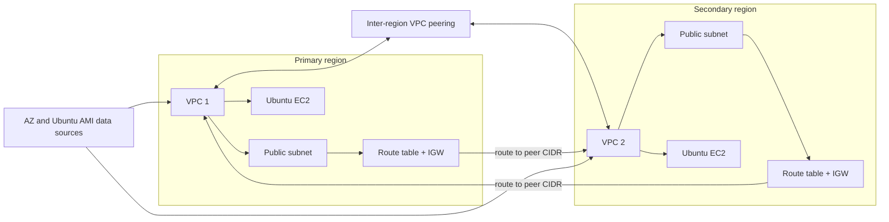

# Cross-Region VPC Peering

## Purpose
Builds two regional VPCs, public subnets, internet gateways, routes, a cross-region VPC peering connection, bidirectional peering routes, security groups, and Ubuntu EC2 test servers.

## Architecture


## Prerequisites
- AWS credentials allowed in both regions.
- Ubuntu AMIs available in both selected regions.
- Existing EC2 key pairs with names supplied by `terraform.tfvars`, one in each region.
- Non-overlapping VPC and subnet CIDRs.

## Run
```powershell
terraform init
terraform fmt -check
terraform validate
terraform plan
terraform apply
terraform output
terraform destroy
```

Provider aliases `primary` and `secondary` connect resources to separate regions. The peering accepter must exist before the reciprocal routes and instances can use the connection. Test connectivity only after route tables and security groups converge.

## Inputs And Outputs
`variables.tf` controls both regions, VPC/subnet CIDRs, instance type, and key names. The supplied CIDR variables should be the source of truth; verify that `main.tf` uses them rather than duplicated hard-coded values. Outputs are currently commented, so add or enable outputs for peering ID and instance public IPs when testing.

## Security And Cost Warnings
SSH is open to `0.0.0.0/0`, and peer traffic is permissive. Restrict both to known administration and application CIDRs. Apache installation uses an unpinned package command. Two public EC2 instances, elastic networking, and cross-region resources can incur charges; destroy the stack after testing.
